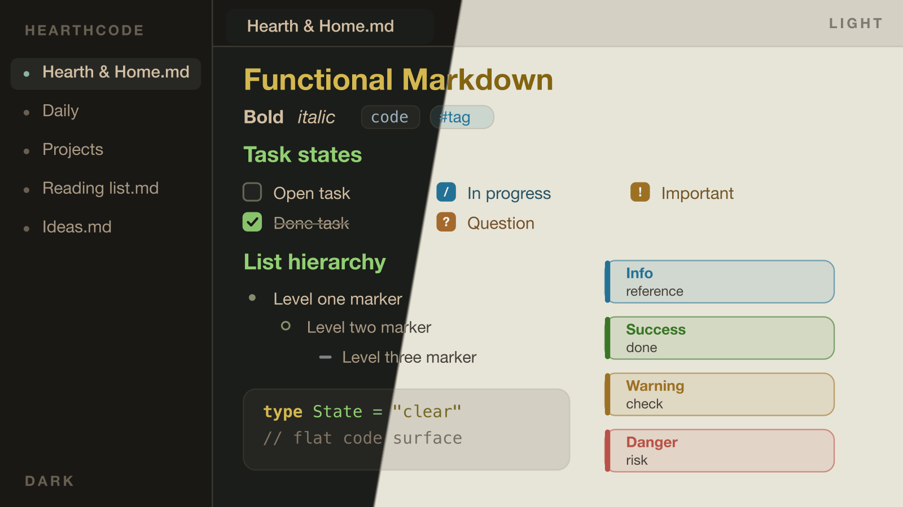

# HearthCode

[English](./README.md) | [简体中文](./README.zh-CN.md) | [日本語](./README.ja.md)

HearthCode はコードUI向けのテーマファミリーです。核になる方向は Ember と Moss の 2 つだけで、それぞれに Dark と Light を用意し、VS Code、Open VSX 互換エディタ、5 種類のターミナル形式で使えます。Obsidian 版は現在 Moss のみです。

## まずはここから

- `Ember`: より暖かく、やわらかく、残り火と紙の方向。
- `Moss`: よりドライで、すっきりしていて、構造が見えやすい方向。
- `Dark`: 混在照明と長時間コーディング向けの基準点。
- `Light`: 昼光や文書作業が多い日に向くライト版。

## Moss について

`Moss` は GruvDark テーマファミリーから方向的な着想を受けています。特にチャコールと紙のバランス、そして分離のはっきりした構文レーンを参照していますが、HearthCode 独自のセマンティック設計と校正ルールを通して再構成しており、1:1 の複製ではありません。

## Obsidian

HearthCode は本格的な Obsidian テーマでもあります。同じカラーランゲージを機能的な Markdown に適用し、種類分けされたコールアウト、取り消し線付きの完了タスク、階層化されたリストマーカー、フラットなコードと引用面、タグのピルを、編集ビューと閲覧ビューで一貫して表示します。

Style Settings プラグインにも対応しています。タイポグラフィ（等幅ノート・コメントの直立表示・可読行幅）、コールアウトの濃さ、そしてコントラスト検証済みのアクセント（Moss / Amber / Slate）を調整できます。いずれも校正済みのパレットには手を加えません。

## インストール

1. VS Code Marketplace: <https://marketplace.visualstudio.com/items?itemName=hearth-code.hearth-theme>
2. Open VSX 互換エディタ: <https://open-vsx.org/extension/hearth-code/hearth-theme>
3. VS Code Quick Open: `ext install hearth-code.hearth-theme`
4. Obsidian: <https://community.obsidian.md/themes/hearthcode> — またはアプリ内の **設定 → 外観 → テーマ → 管理** から **HearthCode** を検索。
5. ターミナル: [Warp、Windows Terminal、Kitty、Alacritty、iTerm2 用テーマ](./terminal/README.md)。最初は `HearthCode Moss Dark` を推奨します。

## 公開中のテーマ

- `HearthCode Moss Dark`
- `HearthCode Moss Light`
- `HearthCode Ember Dark`
- `HearthCode Ember Light`

## Theme Forge

プライマリカラーを変えたいときは、**HearthCode: Open Theme Forge** を実行してパネルを開き、色を選ぶと、テーマ全体——構文**および**エディタのクローム（ステータスバー、サイド / アクティビティ / タイトルバー、各サーフェス）——がダーク / ライトの並列プレビューでリアルタイムに染め直されます。**Apply** は結果を theme-scoped color customizations として書き込み（即時反映、リロード不要）、アクティブな HearthCode スキームのダークとライトの 2 バリアントだけを塗り替え、もう一方のスキームには手を触れません——先に Moss か Ember のバリアントへ切り替えてください。**HearthCode: Reset Theme Forge** は Forge が書き込んだものだけを正確に取り除きます。品質は構築時に担保されます。Forge は公開テーマと同じ品質コントラクトに縛られており、構文レーンはまとめて回転して役割の分離を保ち、彩度は安全な帯域にクランプされ、クロームの色みはコントラスト検証を通してエディタ文字を AA に保ち、機能色（ターミナル・エラー・git・diff）はそれぞれの意味を保ちます。

## イタリックを無効にしたい場合

HearthCode はコメント・型・デコレーターにイタリックを使います。フォントのイタリック表示が好ましくない場合（CJK フォントでは擬似斜体になりがちです）、設定 `hearthcode.disableItalics` を有効にしてください。色はそのままに、すべてのイタリックを無効化し、オフに戻せば元どおりになります。詳細と手動設定の方法は [docs/disable-italics.md](./docs/disable-italics.md) を参照してください。

## リンク

- サイトプレビュー: <https://theme.hearthcode.dev>
- vscode.dev で Ember を試す: <https://vscode.dev/theme/hearth-code.hearth-theme/HearthCode%20Ember%20Dark>
- vscode.dev で Moss を試す: <https://vscode.dev/theme/hearth-code.hearth-theme/HearthCode%20Moss%20Dark>
- ソース: <https://github.com/hearth-code/HearthTheme>
- Issues: <https://github.com/hearth-code/HearthTheme/issues>
- 変更履歴: <https://github.com/hearth-code/HearthTheme/blob/main/extension/CHANGELOG.md>
