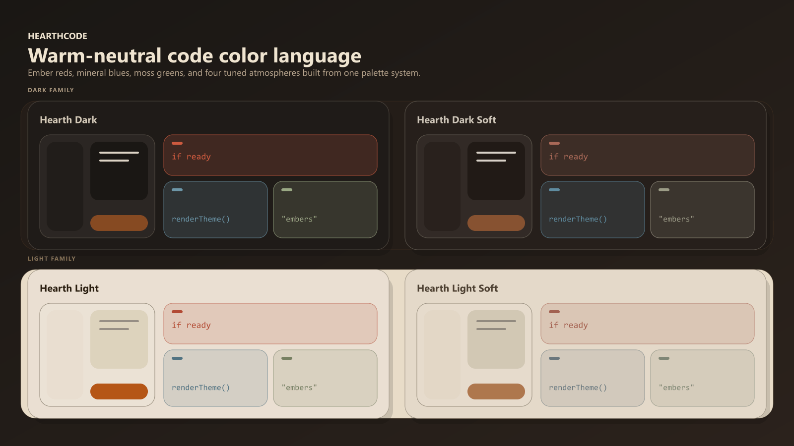
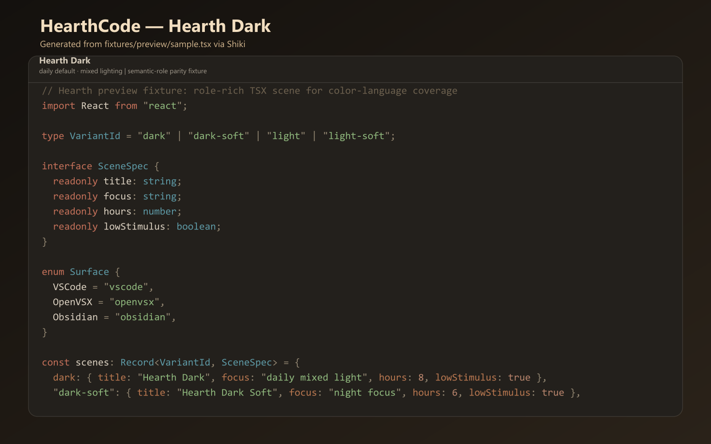
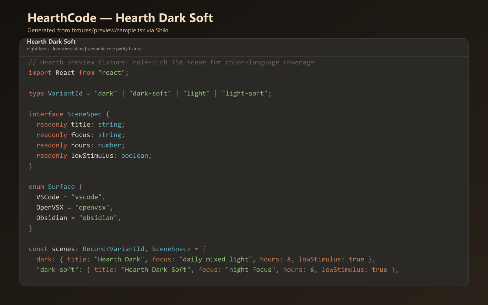
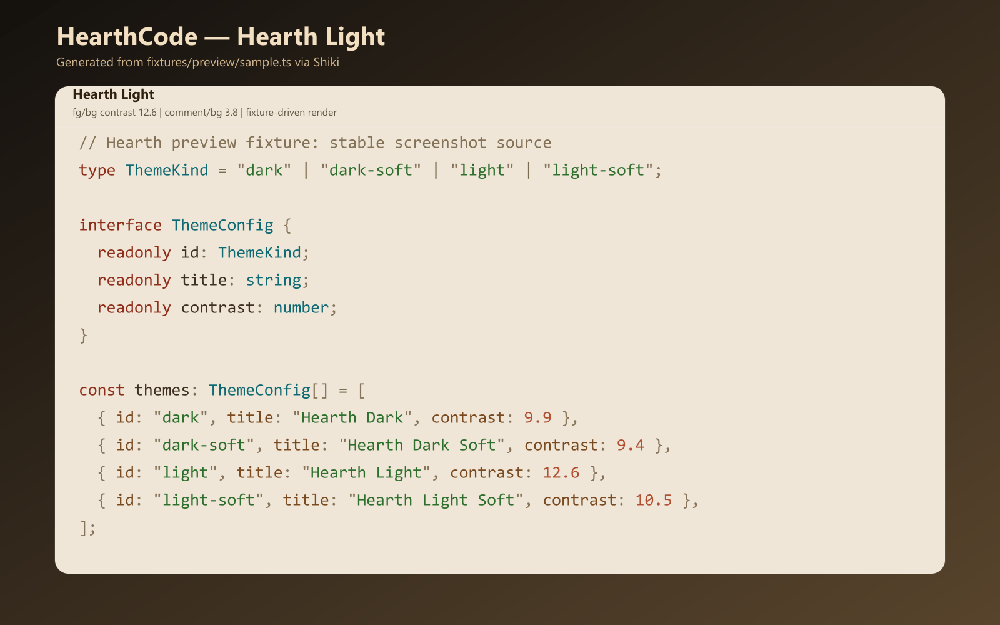
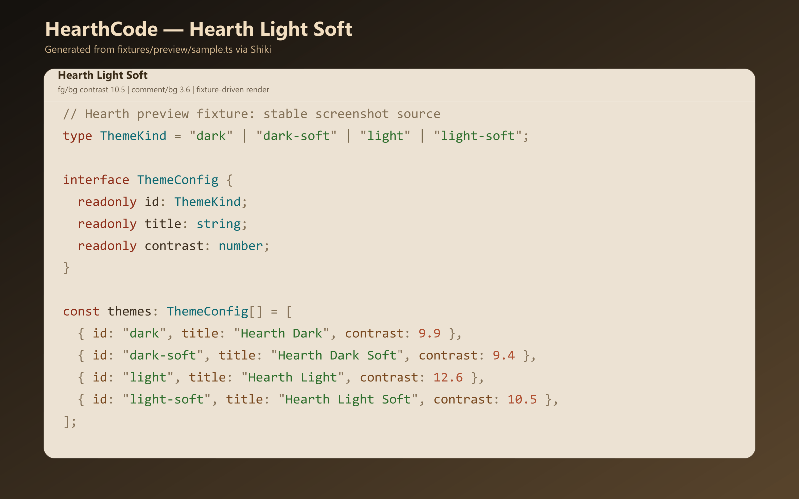

# HearthCode

[English](./README.md) | [Chinese (Simplified)](./README.zh-CN.md) | [Japanese](./README.ja.md)

HearthCode is a warm, low-glare VS Code theme set built for long coding sessions.
It keeps semantic hierarchy stable across `Hearth Dark`, `Hearth Dark Soft`, `Hearth Light`, and `Hearth Light Soft`, so your eyes do less relearning when your environment changes.

## Install

- VS Code Marketplace: <https://marketplace.visualstudio.com/items?itemName=hearth-code.hearth-theme>
- Open VSX: <https://open-vsx.org/extension/hearth-code/hearth-theme>
- VS Code Quick Open: `ext install hearth-code.hearth-theme`

## Why HearthCode

- Warm palette with controlled saturation to reduce harsh glare
- Stable semantic token roles across all four variants
- Fixture-based screenshots and automated audits for release consistency

## Theme Variants

### Hearth Dark (default)

Balanced warm contrast for daily coding.

### Hearth Dark Soft

Lower contrast pressure for late-night or dim-room sessions.

### Hearth Light

Paper-toned light mode for daylight work and docs-heavy tasks.

### Hearth Light Soft

Softer light contrast for long daytime sessions and reduced visual pressure.

## Links

- Website: <https://theme.hearthcode.dev>
- Docs (EN): <https://theme.hearthcode.dev/docs>
- Docs (ZH): <https://theme.hearthcode.dev/zh/docs>
- Docs (JA): <https://theme.hearthcode.dev/ja/docs>
- Source: <https://github.com/hearth-code/HearthTheme>
- Issues: <https://github.com/hearth-code/HearthTheme/issues>

## Maintainer Notes

This repository contains the website and extension package in one mono-repo.

- Website app: `src/`
- Extension package: `extension/`
- Theme source of truth: `themes/`
- Automation scripts: `scripts/`

Key commands:

- `pnpm dev`
- `pnpm run sync`
- `pnpm run check:sync`
- `pnpm run preview:generate`
- `pnpm run audit:all`
- `pnpm run build`

Quality gates:

- Git hooks (Husky):
  - `pre-commit`: runs `pnpm run check:sync`
  - `pre-push`: runs `pnpm run audit:all` and `pnpm run build`
- CI (PR): runs `pnpm run check:sync`, `pnpm run audit:all`, and `pnpm run build`
