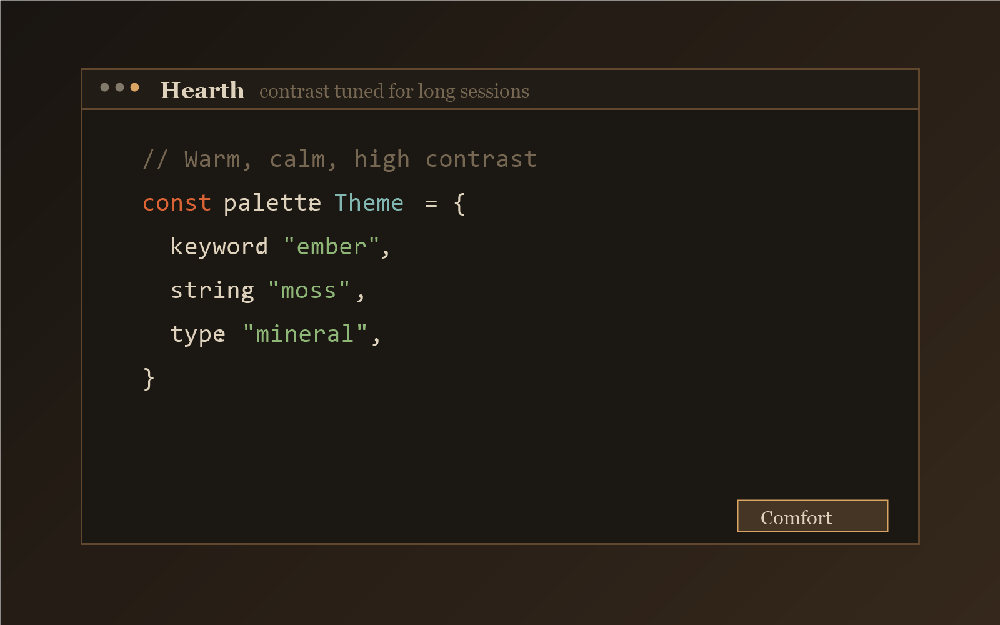

# HearthCode

[English](./README.md) | [简体中文](./README.zh-CN.md) | [日本語](./README.ja.md)

HearthCode is a mono-repo for:

- Website: <https://theme.hearthcode.dev>
- VS Code extension: <https://marketplace.visualstudio.com/items?itemName=hearth-code.hearth-theme>

## What This Project Ships

- Astro site for philosophy, color system, previews, and docs (en/zh/ja)
- VS Code theme extension with:
  - `Hearth Dark` (default)
  - `Hearth Dark Soft`
  - `Hearth Light`

## Preview




## Stack

- Astro 6
- Tailwind CSS 4
- Node.js `>=22.12.0`
- pnpm

## Repository Layout

```text
.
├─ src/                   # Site pages/components/layouts/i18n
├─ themes/                # Source theme JSON (single source of truth)
├─ public/themes/         # Synced JSON for website consumption
├─ extension/             # VS Code extension package and assets
├─ scripts/               # Sync, audits, release, changelog tools
├─ fixtures/              # Audit + preview fixtures
└─ docs/theme-baseline.md # Theme governance baseline
```

## Quick Start

```bash
pnpm install
pnpm dev
```

Local dev server: `http://localhost:4321`

## Commands

Run all commands in repo root:

| Command | Action |
| :-- | :-- |
| `pnpm dev` | Sync themes then start local dev server |
| `pnpm build` | Sync themes then build site to `dist/` |
| `pnpm preview` | Preview production build locally |
| `pnpm run sync` | Sync theme JSON + regenerate `src/data/tokens.ts` |
| `pnpm run preview:generate` | Generate Marketplace preview PNGs from fixed fixture |
| `pnpm run audit:theme` | Theme quality audit (contrast/coverage/drift) |
| `pnpm run audit:cjk` | CJK readability audit |
| `pnpm run audit:release` | Release consistency audit |
| `pnpm run audit:all` | Run all audits |
| `pnpm run changelog:draft` | Draft changelog from theme diffs |
| `pnpm run changelog:append -- vX.Y.Z` | Append generated changelog section |
| `pnpm run bump:ext:patch` | Bump extension patch version (`minor`/`major` available) |
| `pnpm run release:theme -- vX.Y.Z` | One-shot release prep (audit + build + changelog) |
| `pnpm run pack:ext` | Package extension VSIX |

## Theme Update Flow

1. Edit `themes/*.json`
2. Run `pnpm run sync`
3. Run `pnpm run preview:generate`
4. Run `pnpm run audit:all`
5. Run `pnpm run changelog:append -- vX.Y.Z`
6. For extension release, bump version and publish via CI (or `pnpm run pack:ext`)

## CI / Publish

`/.github/workflows/publish.yml` runs on push to `main`:

1. Install dependencies and run audits
2. Build site and deploy to GitHub Pages (if enabled)
3. Check Marketplace version and publish extension when needed

If extension payload changes without a version bump, CI blocks the publish step.
