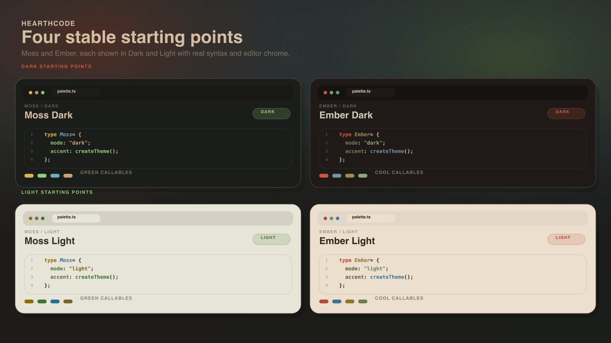

# HearthCode

[English](./README.md) | [Chinese (Simplified)](./README.zh-CN.md) | [Japanese](./README.ja.md)

HearthCode is a theme family for code interfaces with two design directions: Ember and Moss. Each direction ships Dark and Light across VS Code, Open VSX-compatible editors, and Obsidian.

## Start Here

- `Ember`: warm paper, softer warmth, ember-led hierarchy.
- `Moss`: drier paper, cleaner separation, more structural feel.
- `Dark`: balanced default for mixed light and long coding sessions.
- `Light`: bright-room and docs-heavy version.

## Note On Moss

`Moss` takes directional inspiration from the GruvDark theme family, especially its charcoal-and-paper balance and clearer split syntax lanes. It is translated through HearthCode's own semantic system and calibration rules rather than copied one-to-one.

## Install

1. VS Code Marketplace: <https://marketplace.visualstudio.com/items?itemName=hearth-code.hearth-theme>
2. Open VSX-compatible editors: <https://open-vsx.org/extension/hearth-code/hearth-theme>
3. VS Code Quick Open: `ext install hearth-code.hearth-theme`
4. Obsidian: in-app **Settings → Appearance → Themes → Manage**, then search **HearthCode**. Source: <https://github.com/hearth-code/hearthcode-obsidian>

## Shipped Themes

- `HearthCode Moss Dark`
- `HearthCode Moss Light`
- `HearthCode Ember Dark`
- `HearthCode Ember Light`

## Prefer No Italics?

HearthCode styles comments, types, and decorators in italics. If your font renders italics poorly (common with CJK fonts), enable the `hearthcode.disableItalics` setting — the extension switches every italic rule off while keeping all colors intact, and undoes it when toggled back. Details and a manual alternative live in [docs/disable-italics.md](./docs/disable-italics.md).

## Links

- Site preview: <https://theme.hearthcode.dev>
- Preview Ember in vscode.dev: <https://vscode.dev/theme/hearth-code.hearth-theme/HearthCode%20Ember%20Dark>
- Preview Moss in vscode.dev: <https://vscode.dev/theme/hearth-code.hearth-theme/HearthCode%20Moss%20Dark>
- Source: <https://github.com/hearth-code/HearthTheme>
- Issues: <https://github.com/hearth-code/HearthTheme/issues>
- Changelog: <https://github.com/hearth-code/HearthTheme/blob/main/extension/CHANGELOG.md>
