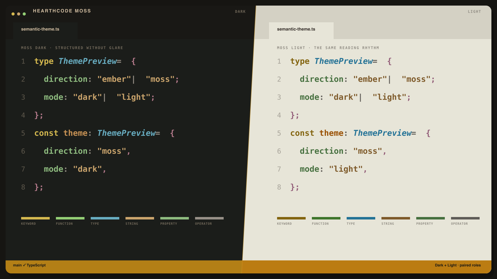
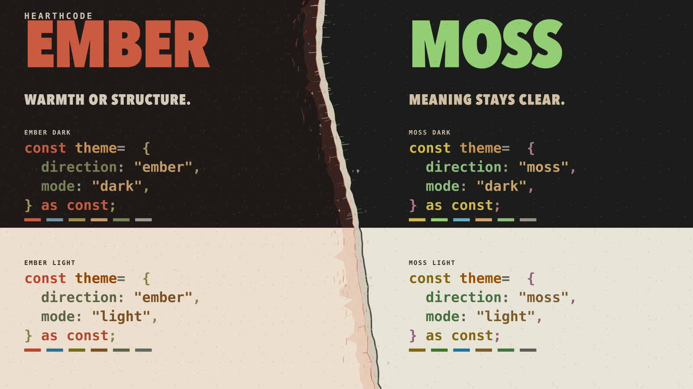
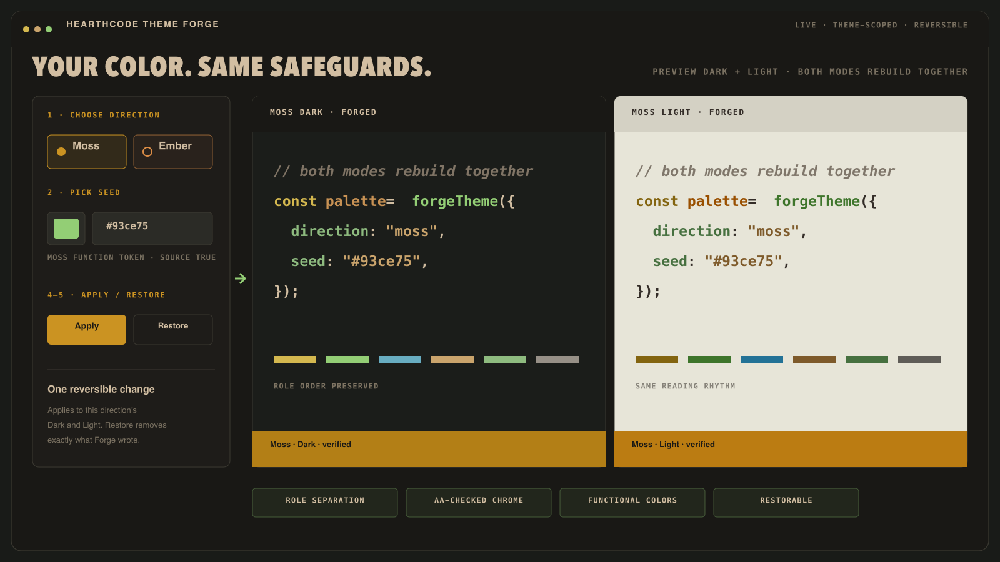

# HearthCode

**Warmth or structure. Meaning stays clear.** Choose warm **Ember** or dry, editorial **Moss** in Dark and Light. Both keep the same reading rhythm through syntax and editor chrome; the built-in **Theme Forge** carries that system into your own primary color.

## Try it or install

- [Try Moss Dark in vscode.dev](https://vscode.dev/theme/hearth-code.hearth-theme/HearthCode%20Moss%20Dark)
- [Try Ember Dark in vscode.dev](https://vscode.dev/theme/hearth-code.hearth-theme/HearthCode%20Ember%20Dark)
- [Install from the VS Code Marketplace](https://marketplace.visualstudio.com/items?itemName=hearth-code.hearth-theme)
- [Install from Open VSX](https://open-vsx.org/extension/hearth-code/hearth-theme)
- Or open VS Code Quick Open and run `ext install hearth-code.hearth-theme`

## Choose your direction

- **Moss:** dry charcoal and paper, clearer syntax lanes, calm green callable structure.
- **Ember:** warm charcoal and paper, softer hierarchy, ember-led control flow.
- **Dark:** balanced for mixed light and long coding sessions.
- **Light:** tuned for bright rooms and docs-heavy work.

The extension includes:

- `HearthCode Moss Dark`
- `HearthCode Moss Light`
- `HearthCode Ember Dark`
- `HearthCode Ember Light`

## Theme Forge

Want your own primary color? Run **HearthCode: Open Theme Forge** inside the editor.

1. **Pick** Moss or Ember and choose a seed color.
2. **Preview** syntax and editor chrome together in Dark and Light.
3. **Apply** theme-scoped overrides live. **Restore original theme** removes exactly what Forge wrote and returns to the theme that was active before the first Apply.

Forge keeps role separation, safe saturation, AA-checked chrome text, and the meaning of terminal, error, Git, and diff colors intact.

## Why HearthCode

- Syntax and editor chrome are tuned as one system instead of separate color swatches.
- Dark and Light share the same semantic language, so switching modes does not scramble role meaning.
- Generated outputs are checked for contrast, role separation, and source drift before release.

## Prefer no italics?

HearthCode styles comments, types, and decorators in italics. If your font renders italics poorly (common with CJK fonts), enable the `hearthcode.disableItalics` setting — the extension switches every italic rule off while keeping all colors intact, and undoes it when toggled back. Details and a manual alternative live in [disable-italics.md](https://github.com/hearth-code/HearthTheme/blob/main/docs/disable-italics.md).

## Design note

Moss takes directional inspiration from the GruvDark theme family, especially its charcoal-and-paper balance and clearer split syntax lanes. It is re-authored through HearthCode's own semantic system and calibration rules rather than copied one-to-one.

## Links

- Site preview: <https://theme.hearthcode.dev>
- Source repository: <https://github.com/hearth-code/HearthTheme>
- Changelog: [CHANGELOG.md](./CHANGELOG.md)
- Issue tracker: <https://github.com/hearth-code/HearthTheme/issues>
