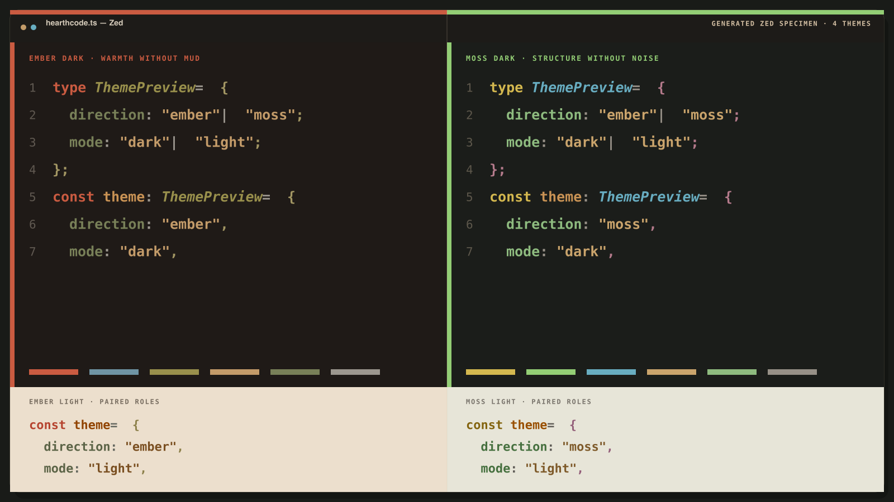

# HearthCode for Zed

Ember warmth or Moss structure, with Dark and Light paired for Zed. Different
material, same reading rhythm — generated from the same calibrated color system.

This repository is a generated distribution mirror. The color system,
generators, audits, and contribution workflow live in
[hearth-code/HearthTheme](https://github.com/hearth-code/HearthTheme). Do not
hand-edit generated theme JSON here.

## Included themes

- HearthCode Moss Dark
- HearthCode Moss Light
- HearthCode Ember Dark
- HearthCode Ember Light

## Local development

In Zed, run `zed: install dev extension` and select the directory containing
`extension.toml`.
